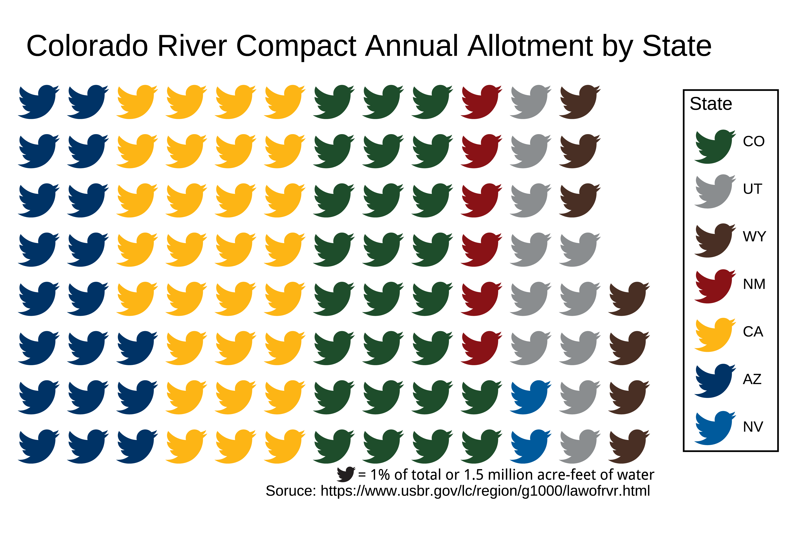

Today I am starting on a journey to complete the [#30DayChartChallenge](https://twitter.com/30DayChartChall). I will be attempting to use mostly hydrological data as well as Python and R and maybe even Julia, Excel, GMT, and other graphical softwares. Figures will be posted on my [twitter account](https://twitter.com/adampricehydro) and I will publish markdown documents with all my code on my [personal website](https://adamnicholasprice.github.io/) and [forked github repo](https://github.com/adamnicholasprice/Edition2022) for this challenge! 

## Day 1

Today I will be making a waffle plot of the annual allotments of Colorado River water using the R package [ggwaflle](https://liamgilbey.github.io/ggwaffle/).

Here we go!

First, lets load some packaages.

```{r message=FALSE}
library(tidyverse)
library(ggplot2)
library(ggwaffle)
```

Next, lets make the dataframe to plot. I am using data from the U.S. Bureau of Reclamation Upper Colorado River Compact of 1948 (https://en.wikipedia.org/wiki/Colorado_River_Compact#cite_note-3)

| State | Percent of allotment | Acre feet of water| Basin Subclass|
| :---: | :-----------: |:------:|
Colorado |	51.75% |3.86 million acre·ft/year (150.7 m³/s)| Upper|
Utah |	23.00%|	1.71 million acre·ft/year (67.0 m³/s)|Upper|
Wyoming |	14.00%| 	1.04 million acre·ft/year (40.8 m³/s)|Upper|
New Mexico |	11.25%|	0.84 million acre·ft/year (32.8 m³/s)|Upper|
Arizona |	0.70% |	0.05 million acre·ft/year (2.0 m³/s)|Upper|
California |	58.70% |	4.40 million acre·ft/year (172 m³/s)|Lower|
Arizona |	37.30% |	2.80 million acre·ft/year (109 m³/s)|Lower|
Nevada |	4.00% |	0.30 million acre·ft/year (12 m³/s) |Lower|


Let's make that data into a tibble and plot it!

```{r}

df <- tibble(
  state = c(rep("CO",26),
            rep("UT",11),
            rep("WY",7),
            rep("NM",6),
            rep("CA",29),
            rep("AZ",19),
            rep("NV",2))
)

waffle_data <- ggwaffle::waffle_iron(df,aes_d(group=state))

ggplot(waffle_data, aes(x,y, fill = group)) + 
  geom_waffle() +
  coord_equal() +
  theme_waffle()
```

Now this is pretty ugly and there is some additional functionality within ggwaffle that we can use to spruce this up.

First we will find the HEX codes for my favorite university in each of those states to color the peices of the waffle. Then we will load the package [emojifont](https://github.com/GuangchuangYu/emojifont) to switch up the labels a bit!

```{r crcPlot}
library(emojifont)  
library(dplyr)

st_col = 
  c("CO" = "#1E4D2B",
    "UT" = "#8A8D8F",
    "WY" = "#492F24",
    "NM" = "#891216",
    "CA" = "#FDB515",
    "AZ" = "#003366",
    "NV" = "#005a9c")

library(emojifont)
library(fontawesome)

waffle_data <- waffle_data %>% mutate(label = fontawesome('fa-twitter'))


ggplot(waffle_data, aes(x, y, colour = group,fill=group)) +
  geom_text(aes(label=label), family='fontawesome-webfont', size=10)+
  coord_equal() + 
  scale_color_manual(
    values=st_col,
    name = "State")+
  xlab(NULL)+
  ylab(NULL)+
  theme_waffle()+
  labs(caption=paste(fontawesome("fa-twitter"),"= 1% of total or 1.5 million acre-feet of water \n Soruce: https://www.usbr.gov/lc/region/g1000/lawofrvr.html  "), )+
  ggtitle("Colorado River Compact Annual Allotments by State")

```

This is pretty good by not perfect. Unfortunately there is no way to get the twitter symbol in the legend or the caption at the bottom. I edited the figure slightly in adobe to get the final and here is the result.



